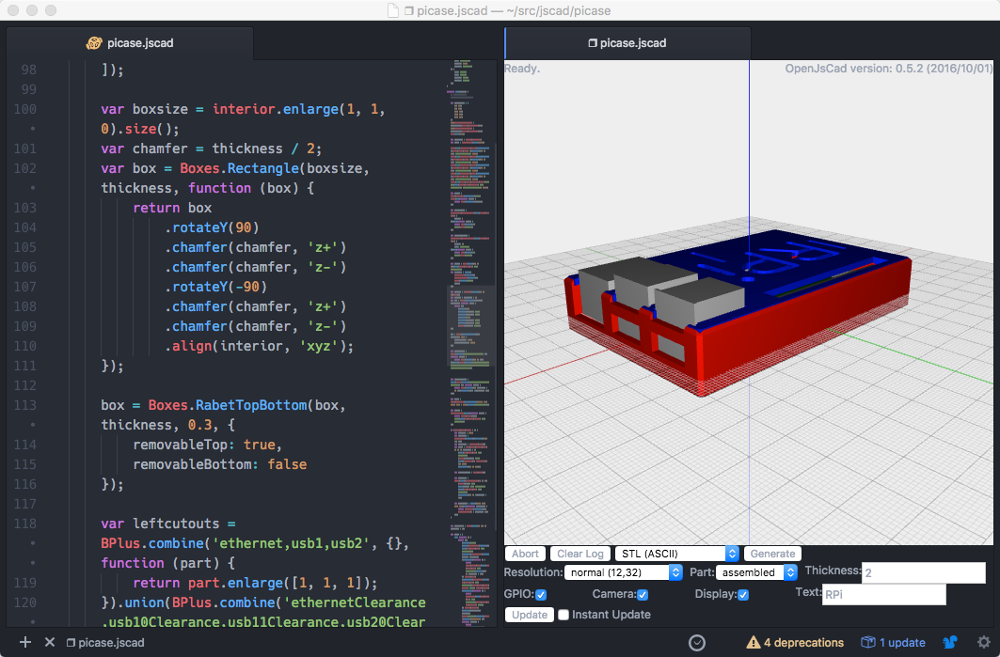
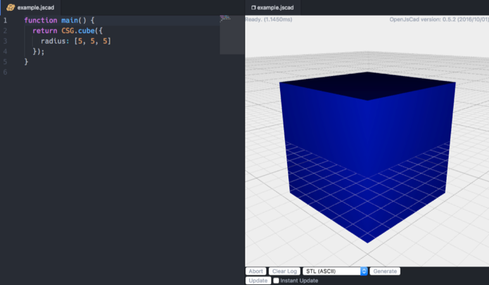

# JSCAD Viewer

View JSCad files inside Atom.



Forked from [atom-scad-preview](https://atom.io/packages/atom-scad-preview).

[OpenJsCad](http://openjscad.org) is similar to [OpenScad](http://www.openscad.org), and allows you to create 3D objects using JavaScript.  Look at the [Programming Guide](https://en.wikibooks.org/wiki/OpenJSCAD_User_Guide#OpenJSCAD_Programming_Guide) for detailed information on creating 3D objects.

You can also look at [jscad-utils](https://github.com/johnwebbcole/jscad-utils) for utilities to help create complex objects using OpenJsCad.

## Install

Install the atom package using preferences or `apm install jscad-viewer`.

To install the development package, clone the repo then `cd` into the directory
and run `apm install`.

To update the OpenJsCad files, `cd` into the `standalone` directory and `./update.sh`.

You can access the console by pressing `opt-cmd-i`.  Changes in the
`standalone` directory will be shown the next time you open a preview.  `lib` changes
need atom to reload, which can be done with `ctrl-opt-cmd-l`.  If you start atom
in dev mode, use the menu View->Developer->Open in dev mode... changes to the
`styles/atom-scad-preview.less` file are hot re-loaded.


## Basic Example
Create a new file named `example.jscad` and include the following:

```javascript
function main() {
  return CSG.cube({radius:[5,5,5]});
}
```

Right click on `example.jscad` and select *View JSCAD file*.  A blue cube should appear
in the right pane.



You can use the mouse to rotate and zoom the camera.  Below the viewer, you can export the object as different file types including `.stl` for use in a slicer.

## jscad-utils example

The easiest way to use `jscad-utils` is with the yeoman jscad generator.  It's possible to use the utilites by itself, as detailed in the instructions.  You will need [NodeJS]() and [Gulp]() installed

Follow the instructions to install the generator [here](https://github.com/johnwebbcole/generator-jscad).

Create a directory called `myproject`, and inside it run `yo jscad`.  Follow the prompts.

You will get a `myproject.jscad` file for your project.  Running `gulp` will create a `dist/myproject.jscad` file.  Right click on the `dist/myproject.jscad` file in Atom and select *View JSCAD file* and the object should appear in the viewer on the right.

Using the [platformio-ide-terminal](https://atom.io/packages/platformio-ide-terminal) atom plugin to run gulp gives you a nice IDE.
